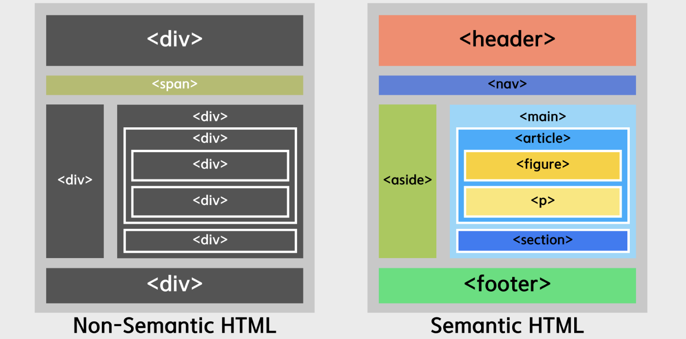

## 시맨틱(Semantic)

- 시맨틱 단어 그 자체에는 *‘의미의, 의미론적인’* 라는 뜻
- 시맨틱 태그는 태그 내용에 **의미를 부여하는 태그**

- **시맨틱 태그(Semantic Tag)**
    - 포함된 콘텐츠의 특정 의미를 정의하고 목적을 갖는 태그
    - 기존 HTML `
` 태그의 기능과 마찬가지로 block element이면서 사이트의 구조(레이아웃)을 설계하기 위해 존재
    - 콘텐츠를 논리적 섹션으로 구성하고 각 부분의 역할과 기능을 전달하는 데 도움
    - **HTML의 구조를 설계하는데 있어 태그에 의미를 부여함으로써 웹사이트의 구조를 파악하기 쉽도록 도와주기 위해 만들어진 것**

- 시맨택 태그의 종류
    - `<header>`, `<nav>`, `<article>`, `<section>`, `<footer>`, `<main>` 등이 존재
    - 

---

### 시맨틱 태그의 이점

1. **접근성 향상**
    - HTML 시맨틱 태그 요소는 사람들이 웹페이지를 탐색하고 페이지와 상호 작용하는 데 도움이 되는 화면 판독기, 키보드 또는 음성 명령과 같은 보조 기술에 대한 유용한 정보와 단서를 제공
    - 예를 들어, `<nav>`의 경우, 콘텐츠에 탐색 링크가 포함되어 있음을 나타낼 수 있고, `<article>`의 경우에는 독립형 콘텐츠가 포함되어 있음을 나타낼 수 있음
    - 웹페이지의 다양한 섹션을 명확하게 정의하고 웹 전체의 일관성을 유지함으로써 사용자 경험과 만족도 또한 향상시킬 수 있음

2. **SEO(검색엔진최적화) 향상**
    - SEO (검색엔진최적화)는 Google과 같은 검색엔진 상에서 웹사이트 순위에 영향을 미침
    - 관련 키워드와 문구에 대해 웹페이지를 최적화하는 데 도움이 되며, 검색결과 상에서 웹 사이트 노출 순위를 높이고 더 많은 트래픽을 유도할 수 있음

3. **가독성 향상**
    - 콘텐츠의 명확하고 일관된 흐름과 구조를 만드는데 도움
    - 제목과 키워드, 요약 등 콘텐츠의 가장 중요하고 관련성 높은 부분을 강조할 때 도움