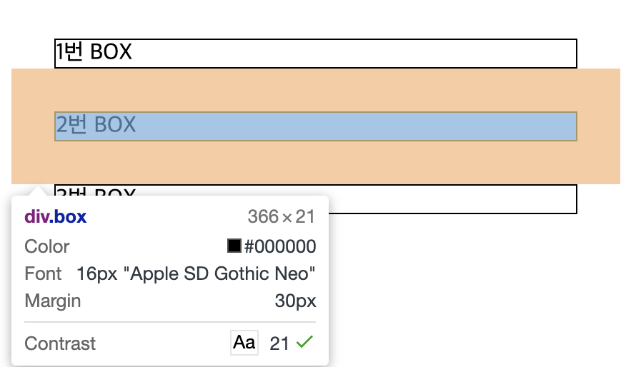
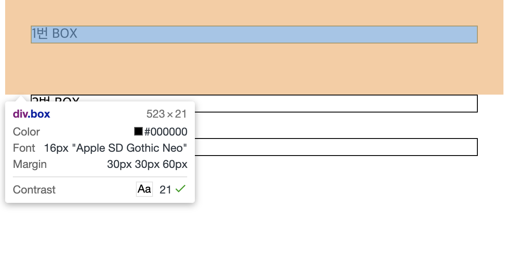
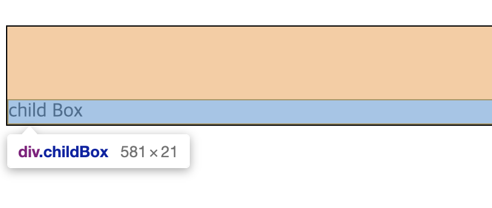

## 마진 상쇄 (Margin Collapsing)

- margin을 가진 두개의 요소끼리 붙어있을 경우 양쪽의 margin이 모두 적용되는 것이 아닌 더 큰 쪽의 여백만 적용되는 현상
- 여백을 가진 모든 요소들을 표현할 경우 웹 페이지가 무분별하게 커지는 것을 방지한 CSS의 필수 속성
- 여백 상쇄는 수직 관계에서만 발생

<br/>

1. **인접 형제 요소 간 바깥 여백이 겹칠 때**



```jsx
<!DOCTYPE html>
<html>
<head>
    <title></title>
</head>
<body>
    <style>
        .box{
            margin:30px;
            border:1px solid;
        }
    </style>
    <div class="box" style="margin-bottom: 60px;">
        1번 BOX
    </div>
    <div class="box">
        2번 BOX
    </div>
    <div class="box">
        3번 BOX
    </div>


</body>
</html>
```

- 1번 BOX의 margin-bottom값을 60으로 주면 더 큰 값의 margin이 적용



<br/>

2. **부모와 자식을 분리하는 content가 없을 때**

```jsx
<!DOCTYPE html>
<html>
<head>
    <title></title>
</head>
<body>
    <style>
        .parentBox{
            margin-top:30px;
            border:1px solid; // 부모 콘텐츠에 속성 적용 추가
        }
        .childBox{
            margin-top:60px;
            border:1px solid;
        }
    </style>
    <div class="parentBox">

        <div class="childBox">
            child Box
        </div>

    </div>

</body>
</html>
```

- 자식과 부모를 분리하는 콘텐츠가 없는 경우 childBox의 margin:60px 가 적용되고 parentBox의 30px가 상쇄



- 부모 콘텐츠의 border(테두리) 속성 적용 시, margin 상쇄를 막음
- *margin 상쇄는 top, bottom에만 적용되기 때문에 `margin-top` 사용*

<br/>

3. **빈 블록**

- border 속성, padding, inline content, height, min-height, max-height 이 없으면 마찬가지로 블록의 margin-top과 bottom이 서로 상쇄

```jsx
<!DOCTYPE html>
<html>
<head>
    <title></title>
</head>
<body>
    <style>
        .box{
            margin-top:30px;
            background-color:#ffbf00;
        }
        .empty{
            margin-top:30px;
            background-color:#ffbf00;
        }

    </style>
    <div class="box">
        BOX 1
    </div>

    <div class="empty">
        <!-- 주석: 빈 박스 -->
    </div>

    <div class="box">
        BOX 2
    </div>

</body>
</html>
```

- 동일한 속성을 가진 empty 클래스지만 빈 요소의 top 마진이 상쇄

<br>

---

**마진 상쇄 예외**

> position: absolute 상태   
float : left, right 상태   
flex 컨테이너를 사용할 때   
grid 컨테이너를 사용할 때