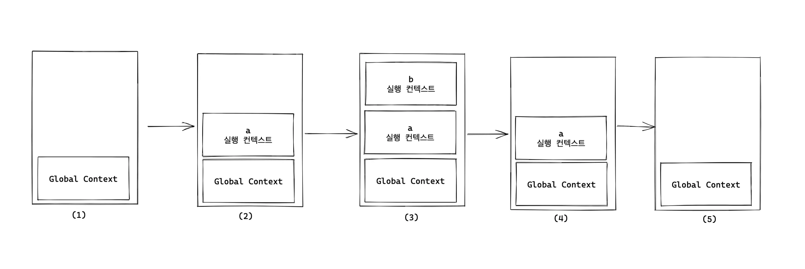

## 실행 컨텍스트 (Execution Context)

- 자바스크립트에서 코드가 실행되는 환경을 의미
- 자바스크립트 엔진이 코드를 실행할 때 그 코드가 실행될 때의 환경을 정의하고 관리하기 위해 존재
- 실행 가능한 코드(일반적으로는 전역 코드와 함수 코드)에 제공할 환경 정보를 모아놓은 것
- scope, hoisting, this, function, closure 등과 같은 js의 동적 언어로서의 동작원리를 담고 있는 JS 핵심 원리

### 실행 컨텍스트의 역할

1. 전체 코드의 환경과 순서를 보장
    - 동일한 환경에 있는 코드를 실행할 때 필요한 환경 정보를 모아 객체 구성
    - call stack에 쌓아올림
    - 가장 위에 쌓여있는 컨텍스트와 관련있는 코드를 실행

    > call stack ??   
    > Javascript 엔진이 원시타입 값과 함수 호출의 실행 컨텍스트를 저장하는 곳(요청이 동기적으로 처리)

2. 실행 컨텍스트가 활성화되는 시점에 선언된 변수를 **호이스팅**
3. 외부 환경 정보 구성
4. this 값 설정

> 실행 컨텍스트는 Javascript의 **동적 언어**로서의 성격을 가장 잘 파악할 수 있는 개념

### 실행 컨텍스트 구성

---

*🖍️ 실행 컨텍스트가 생성되는 경우*
- *전역 공간은 자동으로 컨텍스트로 구성*
- *(일반적인) 함수 실행*
- *`eval()` 함수 실행*
- *블록 생성*

---

실행 컨텍스트를 구성할 때 아래와 같은 것들이 생성

1. **Variable Environment**
    - 현재 컨텍스트 내 식별자들에 대한 정보 + 외부 환경 정보
    - 선언 시점의 Lexical Environment 스냅샷 (변경 사항 반영 X)
    - 전역 컨텍스트에서는 전역 객체가 변수 객체 역할을 하고, 함수 컨텍스트에서는 활성화 객체가 변수와 매개변수를 관리

2. **Lexical Environment**
    - 스코프 체인 : 현재 실행 중인 컨텍스트와 외부 렉시컬 환경의 연결을 유지
    - 변수 참조 시 현재 컨텍스트에서 찾지 못하면 외부 환경으로 범위를 넓혀가며 변수를 찾음
    - 
    - (최초) VariableEnvironment 복사 > 변경사항이 실시간으로 반영
    - **environmentRecord**
        - 현재 컨텍스트와 관련된 코드의 식별자 정보(매개변수 식별자, 함수 자체, 함수 내부 식별자) 저장
        - 호이스팅 발생

    - **outerEnvironmentReference**
        - 현재 호출된 함수가 선언될 당시의 LexicalEnvironment를 참조
        - 스코프, 스코프 체인 형성

3. **ThisBinding**
    - this 식별자가 바라봐야 할 대상 객체
    - 실행 컨텍스트에 따라 참조하는 객체가 달라짐
    - 전역 컨텍스트에서는 this가 전역 객체를 가리키며, 함수 컨텍스트에서는 함수 호출 방법에 따라 달라짐

### 전역 컨텍스트와 함수 컨텍스트

- 전역 실행 컨텍스트
    - 자바스크립트가 처음 실행될 때 생성되는 컨텍스트
    - 프로그램이 종료될 때까지 유지되며 전역에 선언된 변수나 함수가 모두 포함
    - 전역 컨텍스트에서 선언된 변수와 함수는 프로그램 내 어디서든 접근이 가능
    - 기본적으로 자바스크립트는 싱글 스레드 -> 전역 실행 컨텍스트는 1개 존재

- 함수 실행 컨텍스트
    - 함수가 호출될 때마다 생성 되는 컨텍스트
    - 각 함수는 자신만의 실행 컨텍스트를 가지며 이 컨텍스트 내에서 선언된 변수와 함수는 해당 함수 내에서만 유효
    - 함수가 종료되면 그 실행 컨텍스트로 함께 사라짐

1. `전역 컨텍스트` 먼저 실행
2. `함수 실행 컨텍스트` 함수 호출 시마다 컨텍스트 발생
3. 컨텍스트 생성 시, 컨텍스트 안에 변수 객체Variable object, scope chain, this 생성
4. 컨텍스트 생성 후 함수 실행
5. 함수 실행이 마무리되면 해당 컨텍스트는 사라짐 (클로저 제외)
6. 페이지가 종료되면 전역 컨텍스트가 사라짐