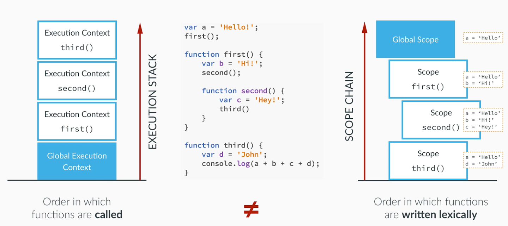

## 스코프(Scope)와 스코프 체인(Scope chain)

### 스코프(Scope)

스코프란 변수 이름, 함수 이름, 클래스 이름과 같은 식별자가 선언된 위치에 따라 다른 코드에서 자신을 참조할 수 있는 범위를 결정하는 개념

스코프는 **변수나 함수가 유효한 범위**를 말하는 것   
(자바스크립트에는 *함수 스코프*와 *블록 스코프* 두 가지 유형이 있음)

1. 함수 스코프(Function Scope)
    - 함수 스코프는 함수 내부에서 정의된 변수가 **해당 함수 내부에서만 유효**하며 외부에서는 접근할 수 없음

2. 블록 스코프(Block Scope)
    - 블록 스코프는 `중괄호({})`로 둘러쌓인 블록 내에서 정의된 변수가 해당 블록 내에서만 유효하며 외부에서는 접근할 수 없음
    - ES6에서 도입된 `let` `const` 키워드를 사용하여 블록 스코프 생성 가능

 

### 스코프 체인(Scope Chain)

- 스코프 체인은 변수를 참조할 때 스코프의 계층 구조를 따라 올라가며 찾는 메커니즘
- 변수를 찾을 때는 항상 아래에서 위로 순차적으로 올라감

> 변수를 찾을 때는 항상 스코프 체인을 따라 순차적으로 검색하며, 변수가 정의된 스코프에서부터 상위 스코프로 차례로 올라감 따라서 중첩된 함수에서 외부 함수의 변수를 참조할 수 있게 됌