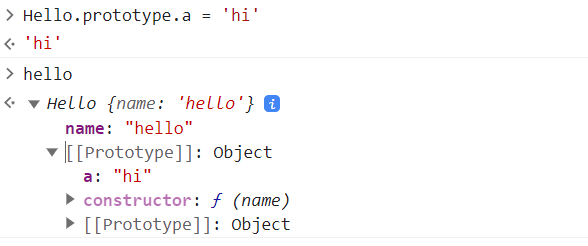
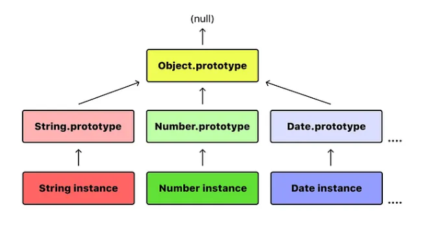

## 프로토타입 Prototype

- 클래스 기반 언어에서는 클래스 내부에 모든 속성과 메소드가 정의되어 있음
- 해당 클래스를 기반으로한 객체가 인스턴스로 생성되면 이 객체는 클래스 내부에 정의되어있는 속성과 메소드에 접근하여 사용할 수 있는 형태

**`prototype`은 이런 클래스와 아주 유사하며 `javascript`의 모든 객체 프로토타입은 값을 할당하는 시점에 결정**

<br/>

> Javascript는 흔히 프로토타입 기반 언어 (prototype-based language)라 불림

모든 객체들이 메소드와 속성들을 상속받기 위한 명세로 프로토 타입 객체를 가진다는 의미

클래스 처럼 객체의 인스턴스를 위한 명세와 같은 역할을 하는데 객체 본인만이 가진 속성과 메소드에도 접근할 수 있으면서 프로토타입의 것들에도 접근할 수 있음

javascript에서 함수를 생성할 때 프로토타입 속성이 함수에 붙여짐
- 예를 들어 `new` 키워드로 함수를 호출할 때마다 생성되는 인스턴스는 함수 프로토 타입의 모든 속성을 상속함

```jsx
const hello = function(name) {
  this.name = name;
}
```

속성과 메소드들은 각 객체 인스턴스가 아니라 객체 생성자의 prototype 속성에 정의되어 있음

**이렇게 자바스크립트의 모든 객체는 자신의 부모 역할을 하는 객체와 연결되어있고 이 부모 객체를 프로토타입이라고 함!!**

```jsx
hello.toString(); // [Object object]
```

이런 방식으로 클래스를 상속하여 사용하는 것 같이 객체 지향 프로그래밍 방식을 사용할 수 있음



---

### Prototype 접근

- 프토토타입에 접근하기 위해 `__proto__`(deprecated)를 인스턴스에 사용하거나 `Object.getPrototypeOf`(instance)를 사용

```jsx
function Hello(name) {
  this.name = name;
}
const hello = new Hello('hello');
Object.getPrototypeOf(hello) === Hello.prototype; // true
```

### Prototype Chain 프로토타입 체인



- 모든 객체들은 메소드와 속성을 상속받기 위한 명세로 프로토타입 객체를 가짐
- 이는 프로토타입 객체도 또 다시 상위 프로토타입 객체로부터 상속받을 수 있고 그 상위도 마찬가지인데 이를 **프로토타입 체인**이라고 함!!

- 다른 객체에 정의된 메소드와 속성을 한 객체에서 사용할 수 있게 해줌
- 객체 자신의 것 뿐 아니라 `[[Prototype]]`가 가리키는 링크를 따라 부모 역할을 하는 모든 프로토 타입 객체의 속성이나 메소드에 접근할 수 있음

```jsx
const num = 55;
num.push // undefined;
num.push() // Uncaught TypeError: num.push is not a function
Object.prototype.push = function() {return this + 1};
num.push() // 56;
```

- 본질적으로 모든 프로토타입이 객체이기 때문에 다른 모든 프로토타입에서도 발생하며 최상위의 `Object.prototype`에서도 찾지 못하게 된다면 `undefined`를 리턴

### 모든 속성, 메소드가 상속되지 않는 이유 ?

상속받는 멤버들은 `prototype` 속성에 정의되어있고 이들만 상속

`Object.prototype.`로 시작하는 속성들을 말하며 생성자로 생성되는 인스턴스 뿐 아니라 `Object.prototype`을 상속받는 객체라면 접근할 수 있음

- 배열을 선언하고 `push` `pop` 등의 메서드를 사용할 수 있음
- 이들은 `Array.prototype`의 메서드이기 때문

```jsx
const a = [];
a.isArray(); // Uncaught TypeError: a.isArray is not a function
```

- 프로토타입에 정의되지 않은 멤버들은 상속되지 않기 때문에 직접 사용할 수 없으며 `Array` 전역 객체를 이용해 직접 접근할 수 밖에 없음