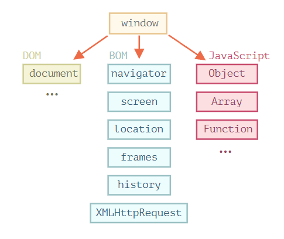

## BOM과 DOM

### Window 객체
- JavaScript의 **최상위 객체**이자 **전역 객체**이면서 모든 객체가 소속된 **글로벌 객체**이다.
- 객체화된 수 많은 구성 요소들로 이루어져 있다.
- window 객체의 프로퍼티나 메소드는 window를 생략하고 바로 사용할 수 있다.

    ```jsx
    alert("알림 메세지입니다.")
    ```

- window 객체 구조



<br/>

### DOM(Document Object Model, 문서 객체 모델)
- 브라우저가 웹 문서를 이해할 수 있도록 구성된 것
- html 태그를 **동적으로 제어**한다.
- 브라우저가 html 페이지를 로드하는 과정에서 **태그(Tag)들을 각기 하나의 객체**로 만든다.
- html 등의 문서의 내용을 **노드 트리(node tree)** 구조의 객체들로 나타낸다.
- **html과 JavaScript를 연결**해주는 역할로 JavaScript를 이용해 각 요소에 접근한다.

    - `Document Node` : 트리의 최상위에 존재하는 HTML 문서 전체
    - `Element Node` : `<P>`, `<dic>` 등의 태그들
    - `Attribute Node` : `<input>` 등의 태그(Tag)안의 name, value 등의 속성
    - `Text Node` : HTML 문서의 모든 텍스트 표현
    - `Comment Node` : HTML 문서의 모든 주석

<br/>

### BOM(Browser Object Model, 브라우저 객체 모델)
- JavaScript가 **브라우저와 소통**하기 위해서 만들어진 모델이다.
- 모든 개별 객체들은 최상위 객체인 window 아래 존재
- 웹 페이지 내용을 제외한 웹 브라우저 창에 포함된 **모든 객체 요소**들을 의미합니다.
- window 속성에 속하며 document 문서가 아닌, **window를 제어** 한다.

    - `wndow`	최상위 객체로 각 프레임별로 하나씩 존재
    - `location`	url 주소에 대한 정보를 제공
    - `document`	현재 문서에 대한 정보
    - `navigator`	브라우저의 정보를 제공, 주로 호환성 문제를 위해 사용
    - `history`	브라우저의 방문 기록 정보를 제공
    - `screen`	브라우저의 외부 환경에 대한 정보를 제공