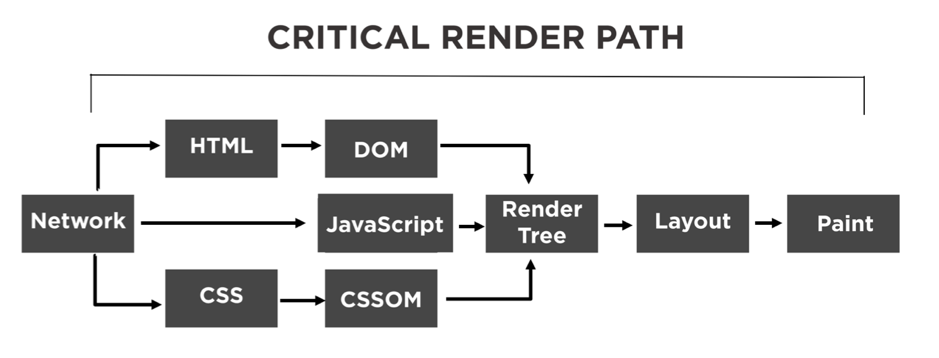

## 브라우저 랜더링 과정

**주요 랜더링 경로(Critical Rendering Path, CRP)**

 

1. **불러오기**  
로더(Loader)가 서버로부터 전달받은 리소스 스트림을 읽는 과정

2. **파싱을 통한 DOM, CSSOM 생성**   
웹 엔진의 HTML/XML 파서가 문서를 파싱해 DOM Tree를, CSS 파서가 CSSOM 트리를 생성

3. **생성된 DOM과 CSSOM으로 렌더 트리(Render Tree) 생성**   
DOM Tree + CSSOM Tree, 렌더링에 필효한 노드만 선택해 페이지를 렌더링하는데 사용   
`변환` -> `토큰화` -> `렉싱(Lexical analysis)` -> `트리 생성`

4. **css, 레이아웃(Layout)**   
렌더트리를 토대로 그려질 노드와 스타일, 크기를 계산   
렌더링 트리에서 위치, 크기등을 알 수 없기 때문에 객체들에게 위치 크기 등을 정해주는 과정   
css는 선택자에 따라서 적용되는 태그가 다르기 때문에 모든 css 스타일을 분석해 태그에 스타일 규칙이 적용되게 결정

5. **페인트(Paint)**  
렌더트리의 각 노드를 실제 픽셀로 변환 ➡️ 실제로 그리는 작업을 실행   
랜더 트리를 순회하며 레이어를 만들고 레이어의 배경, 테두리, 텍스트, 그려지는 순서, 레이어 간의 순서 등 그려지는 과정 기록

6. **합성(Compositing)**   
각 레이어를 분리해서 래스터화한 뒤 브라우저에서 페이지의 크기, 뷰포트에 맞게 합성해 화면으로 나타냄   
*래스터화(rasterizing)란? 정보를 화면의 픽셀로 변환하는 것*