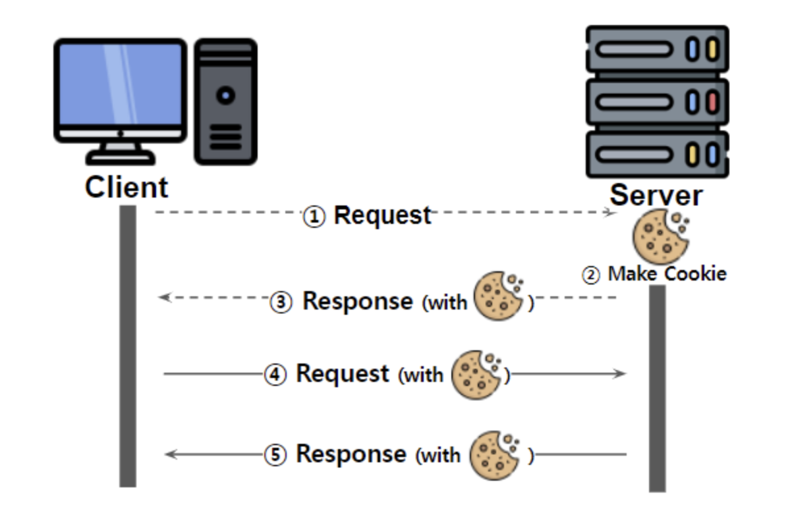
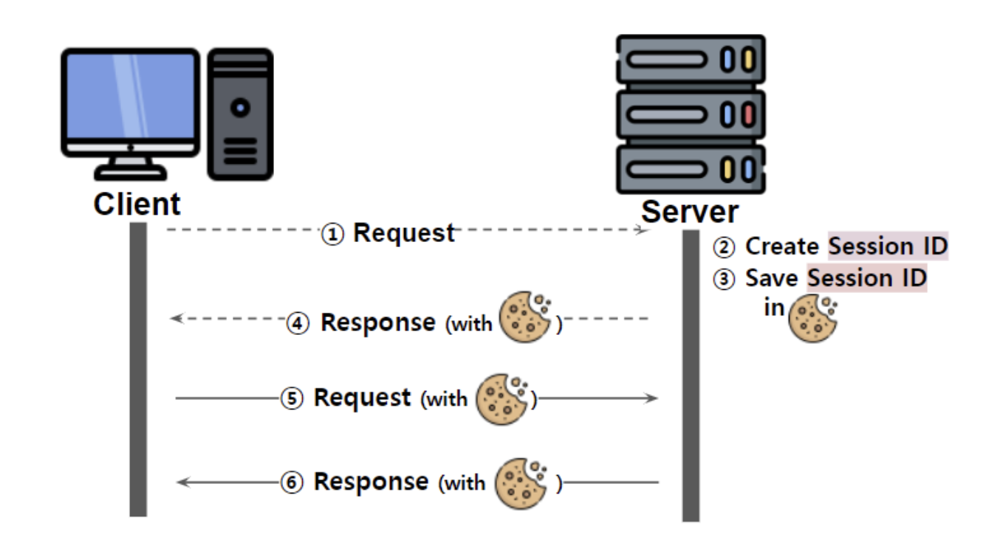

## 쿠키 vs 세션 vs 캐시

*HTTP(비연결, 상태 비저장 프로토콜)는 클라이언트가 누구인지 매번 확인해야 하는 특성을 보완하기 위해 쿠키와 세션 사용*

### 쿠키(Cookie)

- **클라이언트(브라우저/개인) 로컬에 저장되는 키와 값이 들어있는 데이터 파일**
- `이름-값` 쌍으로 정보를 기록하며 만료기간, 도메인, Secure, HttpOnly 등의 정보를 가짐
- 사용자 인증이 유효한 시간을 명시할 수 있음
    - 유효 시간이 정해지면 브라우저가 종료되어도 인증이 유지
- 클라이언트 상태 정보를 **로컬(브라우저)**에 저장 후 참조
- 사용자가 따로 요청하지 안하도 브라우저가 Request시에 Response Header를 넣어서 자동으로 서버에 전송
- 동작 방식

    

    1. 클라이언트가 페이지를 요청하면 서버에서 쿠키를 생성
    2. HTTP 헤더에 쿠키를 포함시켜 응답
    3. 브라우저가 종료되어도 쿠키 만료 기간이 있다면 클라이언트에서 보관
    4. 같은 요청을 할 경우 HTTP 헤더에 쿠키를 함께 보냄
    5. 서버에서 쿠키를 읽어 이전 상태 정보를 변경할 필요가 있을 때 쿠키를 업데이트 하여 변경된 쿠키를 HTTP 헤더에 포함시켜 응답

 

### 세션(session)

- 쿠키를 기반으로 하지만, 사용자 정보 파일을 서버(웹사이트)측에서 관리
- 서버에서는 클라이언트를 구분하기 위해 세션ID를 부여하여 웹 브라우저가 접속해서 종료할 때까지 인증상태를 유지
- 사용지 정보를 **서버**에 두기 때문에 보안에 좋지만 사용자가 많아질 수록 서버 메모리 부담
    - ***성능 저하의 요인이 됌***
- 동작 방식

    

    1. 클라이언트가 서버 접속 시 세션ID 발급
    2. 클라이언트는 세션ID에 대해 쿠키를 사용해 정보를 저장
    3. 클라이언트는 서버 요청 시, 쿠키의 세션ID를 서버에 같이 전달
    4. 서버는 세션ID를 전달 받아, 세션ID로 세션에 있는 클라이언트 정보를 가져와서 서버 요청 처리 후 응답

 

### 쿠키와 세션의 차이점

**상태 정보의 저장 위치 차이**
*쿠키는 서버의 자원을 전혀 사용하지 않으며, 세선은 서버 자원을 사용!*

||**Cookie**|**Session**|
|---|:---:|:---:|
|**저장위치**|클라이언트 로컬|서버|
|**보안**|취약|강함|
|**라이프사이클**|만료시점 기준|브라우저 종료 기준|
|**속소**|빠름|느림|
|**저장형식**|Text|Object|
|**용량**|제한있음|(서버 허용 기준)제한없음|

 

---

### 캐시 (Cache)

- 사용 빈도가 높은 데이터를 고속으로 엑세스할 수 있는 위치에 두는 것, 즉 **임시저장소**
    - 보통 이미지 또는 사진 파일(jpg, png 등), css, js, 배너 등 변경 사항이 크지 않고, 용량이 큰 파일
- 데이터 출력 위치와 가까운 지점에 일시적으로 저장 (페이지 로딩 속도 빠르게 접근 가능)
- 데이터 재사용을 전제로 함
- 데이터 손실 가능성이 있음