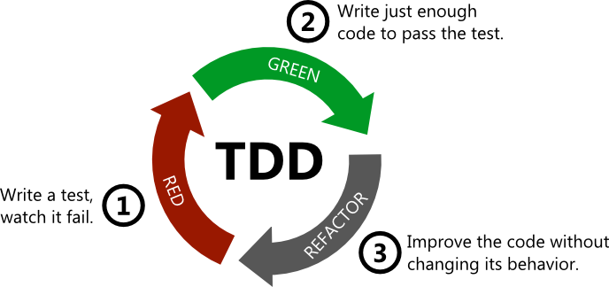

## TDD (Test Driven Development)

- 테스트 주도 개발
- 테스트를 먼저 만든 뒤 테스트를 통과하기 위한 코드를 짜는 개발 방식
- 개발 과정에서 테스트를 먼저 작성하고 이를 통과하는 코드를 구현하는 방식으로 동작 여부에 대한 피드백을 적극적으로 받는 것

> TDD란 결정과 피드백 사이의 GAP에 대한 인식이자 GAP을 조절하기 위한 기술 (by Kent Beck)   
> - 결정: 프로그램 구현 시 어떠한 방식으로, 무엇을 이용해서 코드를 작성할지에 대한 것들을 정하는 것   
> - 피드백: 프로그램을 실행한 결과(코드의 성공과 실패)

### 테스트란?

소프트웨어 관점에서의 테스트란 애플리케이션이 요구 사항에 맞게 동작하는지 검증하는 행위 !!

*유형*

1. 정적 테스트 (Static Test)
- 버그를 유발할 수 있는 코드를 미리 잡아줄 수 있음
- 타입 오류, 린트 오류 체크 등이 해당
- TypeScript, ESLint

2. 단위 테스트 (Unit Test)
- 프로그램의 기본 단위가 되는 모듈을 테스트하는 것을 의미
- 최소 단위의 util 함수, custom hook이나 하나의 컴포넌트 등 작은 단위를 전체 애플리케이션에서 떼어 내어 분리된 환경에서 테스트
- 개발한 모듈이 의도한 대로 동작하는 지에 초점

- 테스트 방식
    - 모듈 내의 데이터 흐름에 대한 예외 케이스를 작성하고 통과 여부를 확인

- 장단점
    - 분리된 상태의 테스트이므로 하나의 모듈, 클래스에 대한 세밀한 테스트가 가능
    - 넓은 범위에서 테스트할 때보다 훨씬 빠르게 실행
    - 의존성이 있는 모듈 제어를 위해 필연적으로 Mock(모의 객체)을 사용할 수밖에 없음
    - 각 모듈의 사소한 API 변경에도 영향을 받으므로 작은 단위의 리팩터링에도 쉽게 문제 발생 가능

3. 통합 테스트 (Integration Test)
- 어플리케이션에서 여러 개의 요소를 함께 돌렸을 때의 동작을 테스트
- 보통 두 개 이상의 모듈이 실제로 연결된 상태를 테스트
- 모듈 간 상호작용이 정상적으로 수행되는 지에 초점

- 장단점
    - 모듈 간의 연결에서 발생하는 에러를 검증
    - 비교적 넓은 범위의 API 변경에만 영향 (단위 테스트에 비해 리팩토링이 쉽게 깨지지 않음)
    - 단일 모듈이 복잡한 알고리즘이나 분기문을 가질 경우 단위 테스트에 비해 테스트 어려움
    - 테스트 중복 발생 가능성

4. E2E 태스트 (End-To-End Test)
- 사용자가 웹앱을 사용하는 것처럼 시뮬레이션 (서버, 인프라, 웹앱 모두 테스트)
- 실제 사용자의 관점에서 테스트를 진행

- 장단점
    - 사용자의 실행 환경과 거의 동일한 환경에서 테스트를 진행
    - 브라우저를 외부에서 직접 제어할 수 있어 JS의 API만으로는 제어할 수 없는 행위에 대한 테스트도 가능 (키보드 입력, 창 크기 변경 등등)
    - 테스트 코드가 실제 코드 내부 구조에 영향을 받지 않음
    - 단위 테스트나 통합 테스트에 비해 실행 속도가 느림
    - 세부 모듈들이 갖는 다양한 상황들의 조합을 고려해야 해서 테스트 작성이 어려움

--- 

### TDD 개발 주기

- TDD는 짧은 개발 주기의 반복에 의존하는 개발 프로세스이
- Extreme Programming의 'Test-First' 개념에 기반을 둔 단순한 설계를 중시

1. **RED**
    - 실패하는 테스트 코드를 작성

2. **GREEN**
    - 테스트 코드를 성공시키기 위한 실제 코드를 작성
    - 테스트를 통과하기 위해 단순 복사하기 + 붙여넣기 또는 설계를 무시한 개발 등도 가능

3. **REFACKFOR**
    - 위의 과정에서 발생한  중복 코드 제거, 올바르지 못한 구조 해결, 일반화 등의 리팩토링을 수행

---

### TDD의 장점

1. 객체지향적 코드 구현
- TDD로 개발 시 기능 별로 모듈화 (재사용을 보장하기 때문)
- 종속성과 의존성이 낮은 모듈로 조합된 개발이 가능 (추후에 모듈 추가 제거가 용이)
- 테스트 친화적인 코드를 작성하다보면 결국 좋은 코드를 설계 가능

2. 재설계 시간 단축
- 테스트 코드를 먼저 작성하므로 무엇을 해야 하는지 분명히 정의한 후 개발에 착수
- 테스트 시나리오를 작성하며 예외 사항에 대해 미리 알 수 있음

3. 디버깅 시간 단축
- TDD의 경우 자동화된 유닛 테스트를 전제하므로 특정한 버그를 쉽게 찾음
- 유닛 테스트의 이점에 해당

4. 추가 구현이 용이
- TDD의 경우 자동화된 유닛 테스트를 전제하므로 테스트 시간을 획기적으로 단축

5. 문서화 가능
- 잘 짜인 코드는 그 자체로 문서
- 시스템이 어떻게 동작해야 하는지에 대한 문서를 자동으로, 최신 상태로 작성 가능

### TDD의 단점

1. **생산성 저하**
- 비즈니스 로직이 라이브러리에 의존할 경우 테스팅 방법이 일관적이지 않을 수 있음
- 테스트 코드에 익숙하지 않으면 기능 구현보다도 시간을 오래 소요될 수 있음

2. 러닝 커브
- 테스트 코드를 작성하고 TDD 개발 주기를 적용함에 있어 적응 기간이 필요