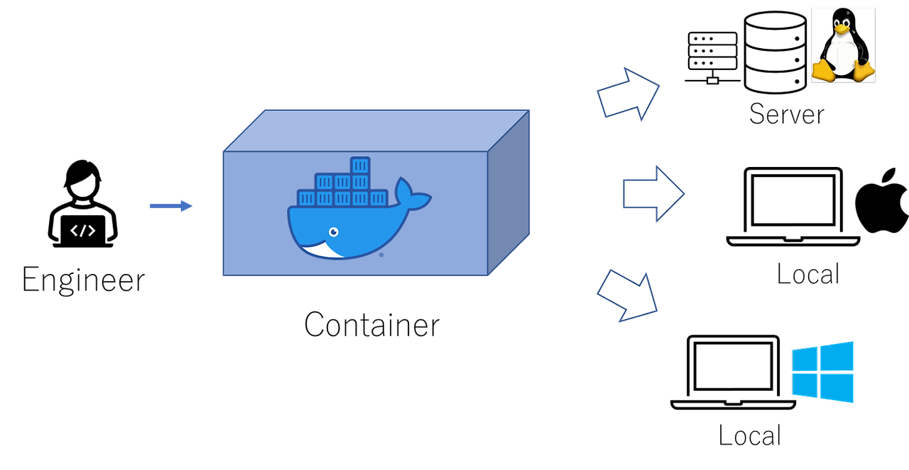
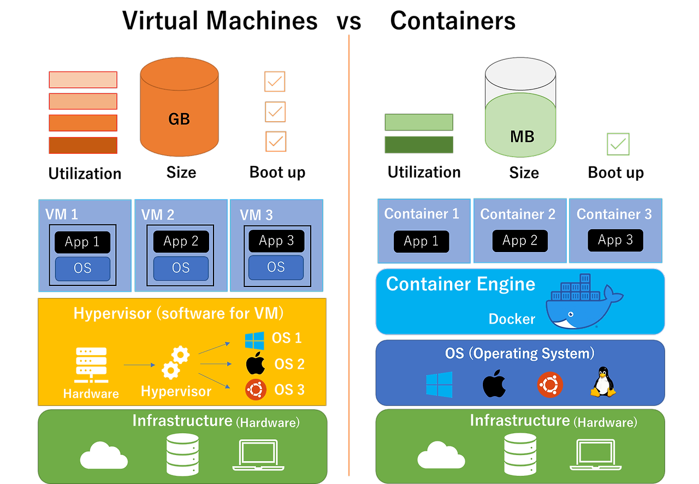

## 도커(Docker)와 컨테이너(Container)

### 컨테이너(Container)

- 애플리케이션과 필요한 라이브러리 및 설정을 하나의 패키지로 묶어 어디서나 일관된 실행 환경을 제공하는 기술
- 운영체제 수준의 가상화를 통해 애플리케이션 간의 격리를 보장

    - Container는 격리된 공간에서 프로세스가 동작하는 기술 -> 다른 OS에서도 문제 없이 개발이 가능
    - Container를 만들기 위해서는 dockerfile, image라는게 필요

### 도커(Docker)

> 근본적으로 Application의 개발과 배포가 편해진다 !!

- 컨테이너 기반의 오픈소스 가상화 플랫폼
- 컨테이너를 생성, 배포, 관리할 수 있음
- 컨테이너화를 쉽게 구현할 수 있도록 다양한 도구와 명령어 제공

    - Docker Engine: 컨테이너를 실행하고 관리하는 엔진
    - Docker Image: 컨테이너 생성에 필요한 설정 및 파일이 포함된 템플릿
    - Docker Container: 도커 이미지를 기반으로 실행된 애플리케이션 인스턴스
    - Docker Hub: 컨테이너 이미지를 공유하고 다운로드할 수 있는 저장소

---

 

> 도커와 가상머신을 혼동하기 쉬운데 차이점은 **개발 환경 OS의 유무**

- Docker은 기존의 OS위에서 Container Engine을 통해 가상환경을 만들어 개발
- VM은 가상환경을 만들때마다 OS를 설치하고 그 위에 개발

- VM은 새로운 OS를 설치하고 그에 필요한 세부적인 프로그램이 또 필요해서 용량을 많이 차지
- 하지만 Docker은 기존의 OS위에 바로 이용하기 때문에 용량을 덜 차지 (부팅업 시간이 적게 듦)

