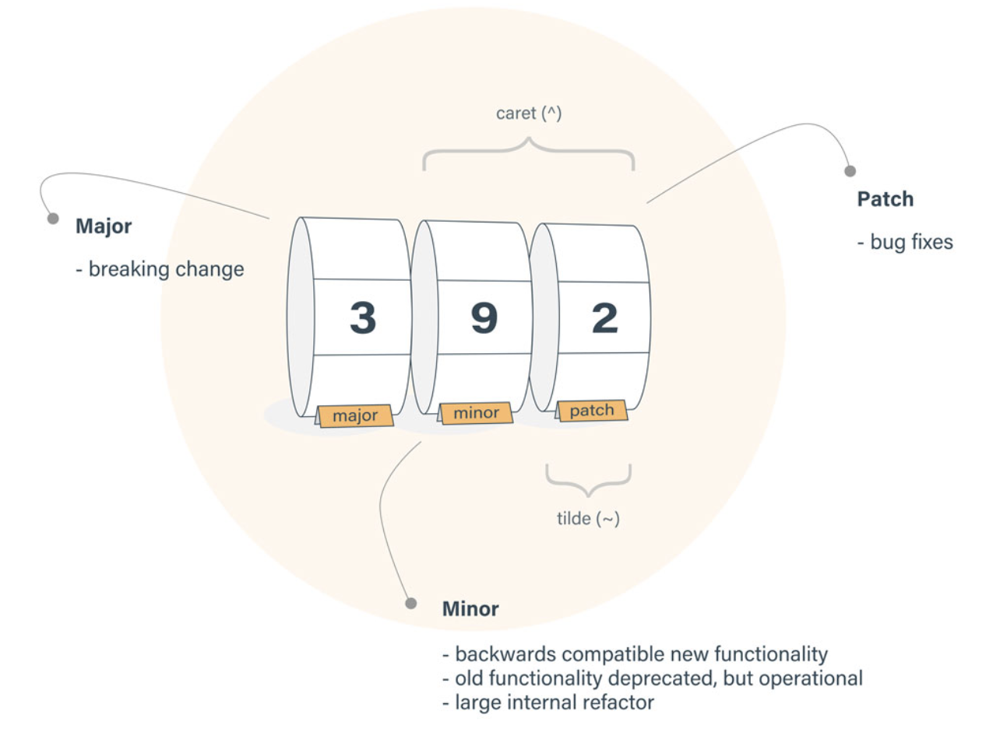

## Semantic Versioning (SemVer)

시맨틱 버저닝(Semantic Versioning)은 소프트웨어의 버전 변경 규칙에 대한 제안

- MAJOR Version이 올라가면 MINOR Version과 PATCH Version은 0이 되어야 함
- MINOR Version이 올라가면 PATCH Version이 0이 반드시 되어야 함
- 정식배포전에 pre-release하는 경우에는 -또는 . 을 사용
- 정식배포전에 git commit후 난수가 붙는 경우 그대로 배포할 경우를 build metadata라고 함
    - ex) 16.9.0-alpha.0
- MAJOR에 0으로 시작하는 경우(0.y.z)는 은 초기 개발을 위해서 사용

### 종류

1. MAJOR: API 호환성이 깨질만한 변경사항
2. MINOR: 하위 호환성 지키면서 API 기능이 추가된 것
3. PATCH: 하위 호환성 지키는 범위 내에서 버그가 수정된 것

### 범위 지정

**틸드(~), 캐럿(^)**

1. 틸드(Tilde(~))범위

    minor version이 지정되어 있다면 patch level 변경을 허용, 그렇지 않은 경우 minor-level 변경을 허용
    - `~1.2.3` : minor version이 지정되어 있으니 patch level 변경을 허용
    - `~1.2` : minor version이 지정되어 있으니 patch level 변경을 허용
    - `~1` : minor version이 지정되어 있지 않기 때문에 minor level 변경을 허용

2. 캐럿(Caret(^))범위

    `[Major, Minor, Patch]`에서 가장 왼쪽에 있는 0이 아닌 요소를 수정하지 않는 변경을 허용
    - `^1.2.3` : 왼쪽에서 맨 처음 0이 아닌 요소는 major 이기 때문에 minor, patch 업데이트를 허용
    - `^0.2.3` : 왼쪽에서 맨 처음 0이 아닌 요소가 minor이기 때문에 patch 업데이트를 허용
    - `^0.0.3` : 왼쪽에서 맨 처음 0이 아닌 요소가 patch이기 때문에 업데이트를 허용하지 않음

