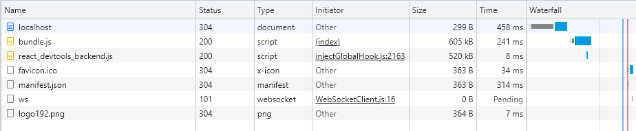
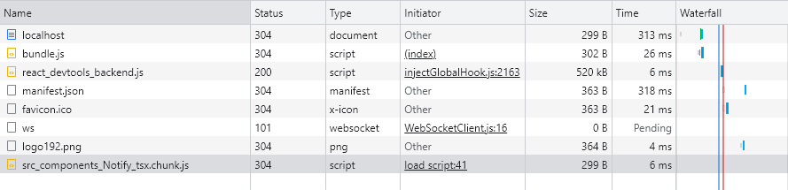

## 코드 스플리팅 (Code Splititting)

리액트 어플리케이션의 경우 빌드를 통해서 배포!   
파일 크기가 성능을 결정하고 결과적으로 사용자 경험에까지 영향을 미치기 때문에 파일 크기를 가능하면 최소화할 필요가 있음   
브라우저에서 JSX나 최신 자바스크립트 문법 등이 문제없이 잘 실행될 수 있도록 트랜스파일링하는 작업도 해야함

>  🔍 일반적으로 이러한 작업은 `웹팩(webpack)`에서 담당   
따로 웹팩을 설정해주지 않으면 프로젝트의 모든 자바스크립트 파일은 하나의 파일로 합쳐지고, CSS 역시 하나의 파일로 합쳐져 비효율적

---

### 리액트에서 code-splitting

**React.lazy + Suspense**

```jsx
import React, { Suspense } from 'react';

const exampleComponent = React.lazy(() => import('./exampleComponent'));

const ex = {
	return (
		<Suspense fallback={<div>Loading...</div>}>
			<exampleComponent />
		</Suspense>
	)
}
```

- `React.lazy` : 컴포넌트를 렌더링하는 시점에 비동기적으로 로딩할 수 있게 해주는 유틸 함수
- `Suspense` : 리액트 내장 컴포넌트로 코드 스플리팅 된 컴포넌트를 로딩하고, 로딩이 끝나지 않았을 때 보여줄 UI를 설정 가능

- 분리할 컴포넌트를 `state`에 선언하여 해당 모듈을 불러와야할 때 `state`를 바꾸어 주는 식으로 진행하여 `React.lazy`를 사용하지 않고 스플리팅 가능

---

### 코드 분할

1. **Route level**

- 라우트마다 다른 컴포넌트로 관리를 하고 있을 경우, 각 라우트를 import 함수를 통해 분리된 빌드 파일로 관리

    ```jsx
    import { BrowserRouter as Router, Route, Switch } from 'react-router-dom';

    const Home = lazy(() => import('./routes/Home'));
    const About = lazy(() => import('./routes/About'));

    const App = () => (
    <Router>
        <Suspense fallback={<div>Loading...</div>}>
        <Switch>
            <Route exact path="/" component={Home}/>
            <Route path="/about" component={About}/>
        </Switch>
        </Suspense>
    </Router>
    );
    ```

- 유저가 다른 페이지로 넘어갈때만 그 페이지를 비동기적으로 로딩

2. **Component level**

- 페이지 안에 있지만 보이지 않는 컴포넌트가 존재할 때 (예를 들어 모달)

- `Notify.tsx`

    ```jsx
    const Notify = () => {
        window.alert('알람입니다!');
    };

    export default Notify;
    ```

- `App.tsx`

    ```jsx
    import React, {useState} from 'react';
    import {TextField, Box, Button} from '@mui/material';

    const App = () => {
        const handleNotify = () => {
                import('./Notify').then(({default: Notify}) => {
                    Notify();
                });
            };
        return (
            <Button variant='contained' onClick={handleNotify}>
                추가
            </Button>
        )
    }
    export default App
    ```

- `handleNotify`함수의 경우 `Button` 클릭 시 동작
- `handleNotify` 안에는 `import('./Notify')`를 호출하는데 **이 `import()`함수는 비동기적으로 모듈을 불러오는** 동적 `import` 문법
- 이ㄷ 때 `Notify`을 즉시 불러오는 것이 아니라, 사용자가 버튼을 눌렀을 때 `Notify.tsx` 파일을 불러와서 `Notify()`함수 실행

<br/>

> ❗️ 내가 이해한 코드스플리팅 작동 방식
> - `import()` 함수는 `웹팩(Webpack)` 같은 번들러에 의해 **코드를 분리**(chunking)할 수 있게 한다. 이 코드에서 `import('./Notify')`는 웹팩에게 *"이 모듈을 따로 떼어 내어 chunk로 저장해 달라"*고 명령하는 느낌
> - 이렇게 하면 `Notify.tsx`는 메인 번들 파일에 포함되지 않고, 따로 `example.chunk.js` 같은 파일로 저장
> - 버튼을 누르면 이 새로운 `chunk.js` 파일이 네트워크 요청을 통해 동적으로 로드되어 실행! 그래서 필요할 때만 코드를 로드하는 방식


<br/>

*`chunck` 파일 생성 차이*

- 스플리팅 전
    
    

- 스플리팅 후

    

<br/>

3. **Page splitting**

- 페이지 하나가 되게 긴 경우,
그 페이지에 들어갈 때 당장 보이는 부분을 나머지와 분리하고 그 뒷부분을 다른 컴포넌트로 만들어 스플리팅
- 사용자가 스크롤하거나 특정 이벤트가 발생할 때 보일 페이지 뒷부분은 코드스플리팅을 통해 나중에 로드하도록...


---

### Webpack: Entry Point

- 웹팩이 앱에서 번들링하려는 모듈의 진입 파일
- 리액트 앱이 여러 엔트리 포인트를 설정한다면 각각의 엔트리 포인트 마다 코드 스플리팅이 가능

    ```jsx
    // webpack.config.js
    const path = require('path');

    module.exports = {
    mode: 'development',
    entry: {
        index: './src/index.js',
        another: './src/another-module.js',
    },
    output: {
        filename: '[name].bundle.js',
        path: path.resolve(__dirname, 'dist'),
    },
    };
    ```

- `entry` 프로퍼티를 작성하면 웹팩에서 자동으로 `index`와 `another`를 다른 `chunk`로 관리를 해서 로딩

> 웹팩은 둘 간의 의존성(dependency)도 분리를 해서 관리를 하는데, 만약 같은 의존성을 여러 `entry point`에서 가지고 있다면, 중복된 로딩이 많아져서 성능 저하를 일으킬 수 있음!   
중복 되는 `dependencies`는 다른 `chunk`로 관리해주는 것이 바람직!!