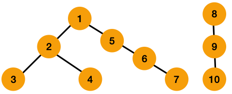

### Union Find 유니온 파인드

- 유니온 파인드 = 분리 집합
- 그래프 형태의 자료들의 **연결 정보**를 알고자 할 때 사용
- 그래프가 존재할 때, 두 개의 노드를 선택해서 해당 노드들이 서로 같은 그래프에 속하는지 판별하는 알고리즘

1. **파인드 (Find)**  
    재귀 적으로 부모를 찾음   
    최종적으로 가장 상위의 루트 노드가 무엇인지 찾음


    - 7의 부모 찾기
    - 7의 부모는 6, 6의 부모는 5
    - 최종적으로 1이 부모임을 알 수 있음

2. **유니온 (Union)**   
    두 개의 사로 다른 노드의 부모가 같다면 두 노드를 합침   
    노드간의 관계는 사라지지만 연결 정보는 알 수 있음


    - 7, 6, 5 세 정점의 부모를 모두 1로 바꿈
    - 나머지 정점에 대해서도 같은 방법으로 부모를 찾음


<br/>

최종적으로 **연결 여부**를 바로바로 알 수 있게 됌

|||
|---|---|
|||

---

### JS로 구현

1. **Initialization(초기화)** : 각 노드가 각각의 집합에 포함되도록 초기화하는 과정

- 자기 자신만의 집합 원소를 가질 수 있도록 배열을 만듦
- N+1 크기의 배열 

```jsx
const init = (N) => { 
  return Array(N).fill(0).map((value, idx) => idx)
}

console.log(init(8))

// 결과값 : [0, 1, 2, 3, 4, 5, 6, 7]
```

2. **Find(찾기)** : 특정 노드의 부모를 찾기 (해당 노드가 속한 집합의 루트를 반환)

- N번째 배열의 저장된 값을 확인
- N번째 배열의 저장된 값을 인덱스 값으로 가지는 M번째 배열의 저장된 값을 확인
- 두 개가 일치한다면 두 개는 연결되어있으며 N 노드의 부모는 M노드가 되는 것

    > 배열의 인덱스와 값이 일치 > 루트 노드라는 의미

```jsx
const find = (x) => {
	// 배열의 인덱스와 배열의 값이 일치한다면 루트노드의 인덱스 값을 리턴
	if (parent[x] === x) {
		return x
	} else {
    // 일치하지 않는다면 재귀함수를 통해 1 depth 더 들어감
		return find(parent[x])
	}
}
```

3. **Union(합치기)** : 두 노드 A와 B를 한쪽으로 합침 

- 합치는 과정에서 => 노드 번호가 작은 쪽 or 큰 쪽 or 트리 높이가 낮은 쪽
- 부모 노드로 올라갈 수록 번호가 작다는 가정일 경우

```jsx
const union = (A, B) => {
	A = find(A)
	B = find(B)
    
    // A와 B가 같다면 이미 연결되어 있는 경우
	if( A === B ) return
    
    // 배열의 B 인덱스에 A 값을 저장
    parent[B] = A
}
```

---

> 📌    
2번의 방법대로 유니온 파인드를 구현한다면   
편향 트리로 구현이 되어지기 때문에 시간복잡도가 O(N)이 걸리게 된다....!

### 경로 압축 (Path compression)

```jsx
const find = (x) => {
	// 배열의 값과 인덱스가 같다면 부모 노드의 인덱스를 반환
	if (parent[x] === x) {
		return x
	}
	// 경로 압축을 위해 부모노드의 값으로 바꿔줌
	const currentParent = find(parent[x])
	parent[x] = currentParent

  return currentParent
}
```

모든 노드는 루트 노드 밑에 속해있기 때문에 부모 노드를 찾았다면   
해당 노드에 기록된 값들을 모두 부모 노드의 값으로 바꿔준다면 시간복잡도를 개선할 수 있음    
이렇게 하면 시간 복잡도는 **O(logN)**

---

### 문제 풀이

https://www.acmicpc.net/problem/1717

+) 추가

런타임 에러 (EACCES) 에러를 마주했다

찾아보니 이 에러는 node 풀이 시 입력 받을 때 `/dev/stdin`을 쓰면 에러가 발생하는 몇개의 문제들이 있다고 한다...   
그래서 굳이 굳이 입력을 바꿔서 제출해야한다!!(zz)   

```jsx
const fs = require('fs');
const input = fs.readFileSync(0, 'utf-8').trim().split('\n')
```