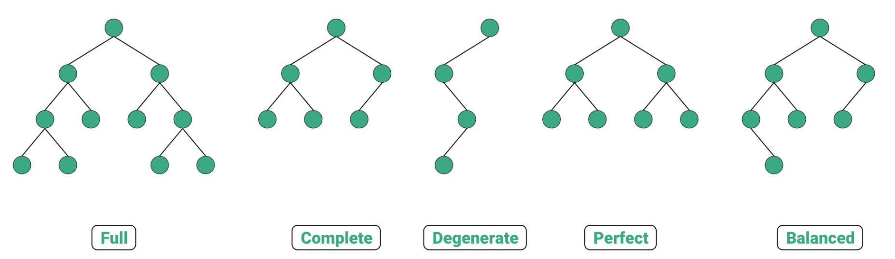

### 문제 풀이

https://school.programmers.co.kr/learn/courses/30/lessons/77486

---

## Tree

> 📌 목표   
> 트리의 종류 및 특성 정리   
> 전위 / 중위 / 후위 순회 정리   
> 트리 자료구조 구현 코드 정리

- 무방향이면서 사이클이 없는 연결 그래프 (Undirected Acyclic Connected Graph)
- V개의 정점을 가지고 V-1개의 간선을 가지는 연결 그래프
- 임의의 두 점을 연결하는 simple path가 유일한 그래프
- 계층적 데이터 구조로, **노드(Node)** 와 **엣지(Edge)** 로 구성
- 최상위 노드는 **루트(Root)**, 자식이 없는 노드는 **리프(Leaf)**

**기본 구조**

```jsx
class Node {
  constructor(value) {
    this.value = value
    this.children = []
  }
}

class TreeNode {
  constructor(value) {
    this.value = value
    this.left = null  // 왼쪽 자식
    this.right = null // 오른쪽 자식
  }
}
```

**레벨 순회 및 전/중/후위 순회**

1. **레벨 순회**
    
    - BFS 기반 구현 (너비 우선 탐색)
    - 큐를 사용하여 노드를 순차적 탐색
    - 1레벨 노드 - 2레벨 노드 - ... 순으로 탐색

2. **전/중/후위 순회**

    - DFS 기반 구현 (깊이 우선 탐색)
    - 트리의 노드를 방문하는 순서를 기준으로 구분

    - 전위 순회 : 노드 → 왼쪽 서브트리 → 오른쪽 서브트리 순서
    - 중위 순회 : 왼쪽 서브트리 → 노드 → 오른쪽 서브트리 순서
    - 후위 순회 : 왼쪽 서브트리 → 오른쪽 서브트리 → 노드 순서


---


**트리의 종류**

1. 일반 트리
    - 기본적인 트리 구조로, 각 노드는 제한 없이 여러 개의 자식을 가질 수 있음

2. **이진 트리**
    - 각 노드가 최대 **두 개의 자식 노드**를 가질 수 있는 트리
    - 이진트리의 종류



3. 트라이
    - **문자열 탐색**에 특화된 트리
    - 문자열의 각 문자가 트리의 노드로 표현됨

4. 세그먼트 트리
    - 구간 쿼리(Query)와 업데이트를 효율적으로 처리하기 위한 트리
    - 특정 구간의 합, 최소값, 최대값 등을 빠르게 계산. O(logN)
    - 범위 합 구하기, 구간 최소값/최대값 구하기


---

### 트리의 구현

트리도 일반적으로 그래프에서 파생되는 자료구조

- 인접 리스트
- 인접 행렬

이진 트리의 경우 왼쪽, 오른쪽 자식을 구분하기 위해 사용자 정의 객체를 만들어서 구현

1. 인접행렬로 구현

- 트리를 그래프처럼 **2차원 배열**로 표현
- adj[i][j] : i번 노드와 j번 노드가 연결되어있는지 여부를 저장
- 인접행렬의 경우 두 가지의 정보를 모름
    - 부모-자식 관계
    - 자식 노드의 왼쪽, 오른쪽 여부

2. 인접리스트로 구현

- 각 노드에 연결된 자식 노드들을 **리스트**로 관리
- `Array.from({ length: n }, () => [])`에서 `parentToChild[parent].push(child)` 부모 정점에 자식 추가
- `Array.from({ length: n }, () => [])`에서 `parentToChild[child].push(parent)` 자식 정점에 부모 추가
- 트리 특성 상 각 정점의 부모는 한개라서 각 정점의 부모 정점이 누구인지 알아야하는 문제의 경우 Map을 활용할 수 있음

3. 해시맵을 이용한 구현

- 각 노드의 키-값 쌍을 부모-자식 쌍으로 표현
- 아래는 부모 정점에 대해 자식 정보를 저장

```jsx
const tree = new Map()

// 0번 노드의 자식: 1, 2
tree.set(0, [1, 2])
// 1번 노드의 자식: 3, 4
tree.set(1, [3, 4])
```

- 아래는 자식 정점에 대해 부모 정보를 저장

```jsx
const tree = new Map()

// 0번 노드의 부모는 1번
tree.set(0, 1)
// 1번 노드의 부모는 2번
tree.set(1, 2)
```