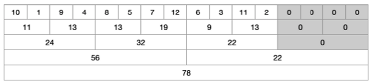
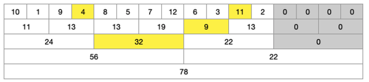
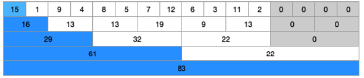

## Segment Tree

[세그먼트트리 참고자료](https://wikidocs.net/209446)

- 구간에 대한 정보를 효율적으로 처리할 수 있는 자료구조
- 구간의 합, 구간의 최솟값, 구간의 최댓값등을 빠르게 구할 때 사용

> 합계를 구하는 **누적합**은 하나의 값이 업데이트 된다면 해당 숫자 뒤의 모든 숫자가 모두 업데이트 되어야 하지만    
**세그먼트 트리**의 경우 구간내의 다양한 값들을 구할 수 있고, 업데이트 되더라도 몇개의 숫자만 업데이트


### 트리 초기화 O(n)

어떠한 데이터들이 주어지고 그 데이터의 구간 합을 구하는 문제라면 누적합을 사용하지만    
중간 중간 값이 업데이트 되거나, 최대값 or 최소값등을 구해야 한다면 세그먼트 트리를 사용 !

```jsx
[10, 1, 9, 4, 8, 5, 7, 12, 6, 3, 11, 2]
```

- 처음에 2개씩 묶어 합계를 구하고, 그 합계들을 또 2개씩 묶어 가며 계속 반복하는 방식으로 트리를 완성
- 마지막에 남은 값이 홀수일 때, 0을 더해 묶어서 처리



### 구간 합 구하기 O(logN)

구간합을 구하는 범위가 주어지면, 그 범위에 해당하는 트리 노드를 찾아서 합계를 구함

- 주어진 범위가 `4부터 11까지`라면, 세그먼트 트리에서 구간이 겹치는 노드만 선택적으로 탐색



- 트리 탐색
    - 범위가 겹치면 해당 노드를 선택해서 합계를 계산
    - 범위가 완전히 포함되면 노드를 반환
    - 범위가 완전히 벗어나면 해당 노드를 탐색하지 않음
    - 구간합을 구할 때, 트리 노드를 따라가며 필요한 범위만 선택적으로 탐색

### 값 업데이트 O(logN)

구간의 값 변경하기   
*누적합을 이용하여 구간합을 계산하면 빠르지만 값 변경이 생기는 경우는 누적합으로 답을 구할 수 없음*   
-> 값이 변경될 때마다 누적합을 다시 다 구해야함 -> 세그먼트 트리를 이용해서 몇개의 숫자만 변경

- 첫 번째 값인 10을 15로 변경
-  10이 포함된 라인의 값 모두에 5씩 더해줌



### JS 구현

1. **세그먼트 트리 초기화**

- 트리 배열을 초기화 하고 리프 노드에 배열 값을 복사
- 트리의 상위 노드들은 구간합을 계산해서 채움

```jsx
class SegmentTree {
    constructor(arr) {
        this.n = arr.length
        this.tree = new Array(2 * this.n)
        this.build(arr)
    }

    build(arr) {
        for (let i = 0; i < this.n; i++) {
            this.tree[this.n + i] = arr[i]
        }

        // 리프 노드의 부모들은 구간합으로 채움
        for (let i = this.n - 1; i > 0; i--) {
            this.tree[i] = this.tree[i * 2] + this.tree[i * 2 + 1]
        }
    }
}
```

2. **구간 합** - 특정 구간 [i, j]에 대해 구간 합

- i와 j는 리프노트로 변환되어 구간 합 계산

```jsx
class SegmentTree {
    constructor(arr) {
        // ...
    }

    // 구간 합 (i부터 j까지)
    query(i, j) {
        i += this.n
        j += this.n
        let sum = 0

        while (i <= j) {
            if (i % 2 === 1) { // i가 오른쪽 자식이면 해당 값을 더하고 오른쪽으로 이동
                sum += this.tree[i]
                i++
            }
            if (j % 2 === 0) { // j가 왼쪽 자식이면 해당 값을 더하고 왼쪽으로 이동
                sum += this.tree[j]
                j--
            }
            i = Math.floor(i / 2)
            j = Math.floor(j / 2)
        }
        return sum
    }
}
```

3. **값 업데이트** - 특정 인덱스 값을 변경하고 트리를 갱신

- 특정 인덱스의 값을 업데이트 후 변경된 값을 트리의 상위 노드에 반영하여 세그먼트 트리를 갱신
- 업데이트는 리프 노드에서 시작해 부모 노드로 올라가면서 각 구간합을 갱신

```jsx
class SegmentTree {
    constructor(arr) {
        // ...
    }

    // 값 업데이트
    update(idx, value) { // 인덱스 idx의 값을 value로 업데이트
        idx += this.n
        this.tree[idx] = value

        // 갱신
        while (idx > 1) {
            idx = Math.floor(idx / 2)
            this.tree[idx] = this.tree[2 * idx] + this.tree[2 * idx + 1]
        }
    }
}
```